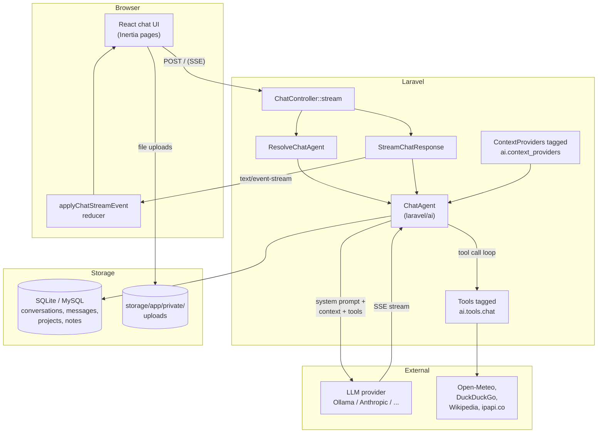

# GAIL (Goals, Actions, Information, Language)

Gail is a local-first, tool-using AI chat app built on Laravel 13, Inertia v3, and React 19. It wraps the `laravel/ai` package to drive an agent (default: Ollama, `gemma4:e4b`) with access to a tagged tool belt — web search, web fetch, Wikipedia, calculator, weather, location, datetime, persistent notes, project-document retrieval (RAG), and optional image generation — and streams responses to a React chat UI over server-sent events. Conversations are organized into projects with custom system prompts and uploaded documents (chunked + embedded for retrieval), support branching, message variants/regeneration, and markdown/JSON export, and a lightweight analytics dashboard tracks tokens, tool usage, and model breakdown.

The application is designed to run on the operator's own machine. By default every inbound HTTP request is restricted to loopback and every outbound tool call goes through a host guard that blocks cloud metadata endpoints and loopback addresses.

---

## Features

- **Chat agents** selected at runtime via `AgentType` (default `ChatAgent`, opt-in `LimerickAgent`) — each with its own tagged tool belt
- **Built-in tools** registered via a DI container tag and discoverable at runtime: Calculator, CurrentDateTime, CurrentLocation, ManageNotes, Weather, WebFetch, WebSearch, Wikipedia, SearchProjectDocuments, and GenerateImage (enabled when `ai.default_for_images` is set)
- **Streaming SSE responses** from any `laravel/ai` provider (Ollama local, or Anthropic/OpenAI/Gemini/Groq/etc.)
- **Projects** with per-project system prompts injected into the agent instructions
- **Project documents + RAG** — upload PDFs/text to a project; `ProcessDocument` chunks and embeds them; `SearchProjectDocuments` retrieves passages over pgvector
- **Voice input** via `POST /transcribe` (audio → text using `laravel/ai` Transcription)
- **Conversation branching** to fork a thread at any message and continue independently
- **Message variants / regenerate** — `variant_of` column groups alternative assistant replies for the same user turn
- **Export** conversations as Markdown or JSON
- **Full-text search** across conversation titles and message bodies
- **Attachments** via a private-uploads route that survives a page refresh
- **Analytics dashboard** for message volume, token usage, tool histograms, per-model breakdown, and cost estimates via `ModelPricing`
- **Host guard** for outbound tool HTTP with shared baseline, wildcard subdomains, and IPv4 CIDR support
- **Host guard for inbound HTTP** via `GAIL_ALLOW_REMOTE=false` by default

---

## Architecture at a glance



- **ChatAgent** ([app/Ai/Agents/ChatAgent.php](app/Ai/Agents/ChatAgent.php)) is a thin orchestrator — it assembles the system prompt from its own `basePrompt()` heredoc plus any registered context providers, exposes tagged tools, and delegates everything else to `laravel/ai`.
- **Tools** ([app/Ai/Tools/](app/Ai/Tools/)) implement `Laravel\Ai\Contracts\Tool` + `App\Ai\Contracts\DisplayableTool`. They are grouped by agent (`Chat/`, `Limerick/`, `MySQLDatabase/`) and registered in [AiServiceProvider](app/Providers/AiServiceProvider.php) under per-agent tags (`ai.tools.chat`, `ai.tools.limerick`, `ai.tools.mysql_database`); adding a new tool means creating the class and registering it there — the agent does not change.
- **Context providers** ([app/Ai/Context/](app/Ai/Context/)) are tagged under `ai.context_providers` and append sections to the system prompt (global notes, project instructions).
- **Frontend** ([resources/js/hooks/use-chat.ts](resources/js/hooks/use-chat.ts) + [resources/js/lib/chat-state.ts](resources/js/lib/chat-state.ts)) parses the SSE stream and dispatches to a pure reducer that builds up the message state.

For the full architecture reference, see [docs/architecture.md](docs/architecture.md).

---

## Prerequisites

| Tool       | Version              | Notes                                                                                                               |
| ---------- | -------------------- | ------------------------------------------------------------------------------------------------------------------- |
| PHP        | 8.3+ (tested on 8.4) | Via Herd or system PHP                                                                                              |
| Composer   | 2.x                  |                                                                                                                     |
| Node.js    | 20+                  | for Vite + React build                                                                                              |
| npm        | 10+                  | or pnpm/yarn — scripts use npm                                                                                      |
| PostgreSQL | 14+ with pgvector    | default driver in `.env.example`; required for document RAG (vector column + index). On macOS, [DBngin](https://dbngin.com/) is the easiest way to run a local Postgres. SQLite works for everything else. |
| Ollama     | latest               | local LLM runtime — **required** if using the default provider; otherwise configure an API provider in `.env`       |

For local development with Ollama, the recommended models are:

- **`gemma4:e4b`** — the default chat model. A ~4B-parameter Gemma variant that handles Gail's tool-routing prompt well on modest hardware. Matches the `OLLAMA_TEXT_MODEL_default` fallback in [config/ai.php](config/ai.php).
- **`bge-m3:latest`** — the default embedding model (1024 dims). Required for the document RAG pipeline (`ProcessDocument` → `SearchProjectDocuments`). Matches the `OLLAMA_EMBEDDING_MODEL` fallback.

Both are assumed by the out-of-the-box config and are referenced by the onboarding walkthrough — install them before first run:

```bash
ollama pull gemma4:e4b
ollama pull bge-m3:latest
```

The repo ships with Laravel Herd support (host PHP at `gail.test`).

---

## Installation

```bash
# 1. Clone and install dependencies
git clone <repo-url> gail && cd gail
composer install
npm install

# 2. Environment
cp .env.example .env
php artisan key:generate

# 3. Database — Postgres is the default in .env.example (required for RAG).
#    On macOS, the easiest way to get a local Postgres is DBngin (https://dbngin.com/).
#    Create a Postgres service in DBngin, then create the database and migrate.
#    The pgvector extension is enabled by a migration.
createdb gail
php artisan migrate

#    To use SQLite instead, set DB_CONNECTION=sqlite in .env and touch the file.
#    Document RAG (SearchProjectDocuments) will be disabled under SQLite.
# touch database/database.sqlite && php artisan migrate

# 4. Pull the default Ollama chat + embedding models (skip if using a cloud provider)
ollama pull gemma4:e4b
ollama pull bge-m3:latest

# 5. Build the frontend
npm run build
```

### Environment variables

Only variables Gail adds on top of the Laravel defaults are listed here.

| Variable                     | Default                                                                    | Purpose                                                                                 |
| ---------------------------- | -------------------------------------------------------------------------- | --------------------------------------------------------------------------------------- |
| `GAIL_ALLOW_REMOTE`          | `false`                                                                    | Allow non-loopback inbound HTTP requests. Set to `true` only behind your own auth + TLS |
| `AI_DEFAULT_PROVIDER`        | `ollama`                                                                   | Single source of truth for which `laravel/ai` provider serves chat. Every `default_for_*` slot below is derived from it via the capability matrix in `config/ai.php`. |
| `AI_DEFAULT_FOR_IMAGES`      | _(derived)_                                                                | Override the image-generation provider                                                  |
| `AI_DEFAULT_FOR_AUDIO`       | _(derived)_                                                                | Override the TTS provider                                                               |
| `AI_DEFAULT_FOR_TRANSCRIPTION` | _(derived)_                                                              | Override the speech-to-text provider                                                    |
| `AI_DEFAULT_FOR_EMBEDDINGS`  | _(derived)_                                                                | Override the embeddings provider                                                        |
| `AI_DEFAULT_FOR_RERANKING`   | _(derived — never from `openai`/`ollama`)_                                 | Override the reranker (use `cohere`, `jina`, or `voyageai`)                             |
| `OLLAMA_API_KEY`             | `ollama`                                                                   | Dummy key required by the Ollama provider                                               |
| `OLLAMA_BASE_URL`            | `http://localhost:11434`                                                   | Ollama daemon endpoint                                                                  |
| `OLLAMA_TEXT_MODEL_default`  | `gemma4:e4b`                                                               | Default chat model                                                                      |
| `OLLAMA_TEXT_MODEL_SMARTEST` | `gemma4:31b`                                                               | Escalation tier used by some flows                                                      |
| `OLLAMA_EMBEDDING_MODEL`     | `bge-m3:latest`                                                            | Embedding model used by `ProcessDocument` (dimensions: 1024)                            |
| `ANTHROPIC_API_KEY`          | —                                                                          | Set to use the Anthropic provider                                                       |
| `OPENAI_API_KEY`             | —                                                                          | Set to use the OpenAI provider                                                          |

See [config/ai.php](config/ai.php) for the full provider list (13 providers supported by `laravel/ai`: Anthropic, Azure, Cohere, Deepseek, Eleven Labs, Gemini, Groq, Jina, Mistral, Ollama, OpenAI, OpenRouter, VoyageAI, XAI).

### Unlocking the full feature set with OpenAI

Ollama serves Gail's text + embeddings path, but it does **not** offer image generation, audio synthesis, or speech transcription. Those surfaces stay dormant under the default Ollama-only config.

`config/ai.php` is driven by **one environment variable** — `AI_DEFAULT_PROVIDER`. Every `default_for_*` slot is derived from a capability matrix in the config, so flipping that one variable turns on whatever the chosen provider supports:

```env
# .env
AI_DEFAULT_PROVIDER=openai
OPENAI_API_KEY=sk-…
```

Capability matrix (from `vendor/laravel/ai/src/Providers/`):

| Capability | Slot | ollama (default) | openai | anthropic | gemini | xai | cohere / jina / voyageai | eleven |
|---|---|:-:|:-:|:-:|:-:|:-:|:-:|:-:|
| Chat text | `default` | ✅ | ✅ | ✅ | ✅ | ✅ | — | — |
| Images | `default_for_images` | — | ✅ | — | ✅ | ✅ | — | — |
| Audio (TTS) | `default_for_audio` | — | ✅ | — | — | — | — | ✅ |
| Transcription | `default_for_transcription` | — | ✅ | — | — | — | — | ✅ |
| Embeddings | `default_for_embeddings` | ✅ | ✅ | — | ✅ | — | ✅ | — |
| Reranking | `default_for_reranking` | — | — | — | — | — | ✅ | — |

Individual slots can be forced with per-capability env vars if you want a hybrid setup — e.g. keep chat local on Ollama but use OpenAI for voice input only:

```env
AI_DEFAULT_PROVIDER=ollama
AI_DEFAULT_FOR_TRANSCRIPTION=openai
OPENAI_API_KEY=sk-…
```

Important caveats:

- **Privacy trade-off:** Gail is local-first by default. Switching `AI_DEFAULT_PROVIDER` to `openai` sends every chat turn to OpenAI. Prefer the hybrid pattern above if that matters to you.
- **Embedding dimension change:** OpenAI's embedding models do not produce 1024-dim vectors. If `default_for_embeddings` resolves to `openai`, you must re-ingest every project document — the existing `document_chunks.embedding` column is sized to Ollama's `bge-m3` output.
- **Tool registration is a boot-time check.** `GenerateImage` is only tagged in [AiServiceProvider](app/Providers/AiServiceProvider.php) when `ai.default_for_images` is non-null. After changing env, run `php artisan config:clear` (or restart the server).
- **Reranking is never auto-derived from `openai`** — the OpenAI driver doesn't implement it. Set `AI_DEFAULT_FOR_RERANKING=cohere` (or `jina` / `voyageai`) with the matching API key if you want reranking.
- **Transcription cost / latency:** `POST /transcribe` ships the raw audio upload to OpenAI's Whisper endpoint. The browser mic UI sends up to 25 MB per clip — be mindful on metered bandwidth.

---

## Running

### Development (all-in-one)

```bash
composer run dev
```

This starts four concurrent processes: `php artisan serve`, `php artisan queue:listen`, `php artisan pail` (live logs), and `npm run dev` (Vite HMR).

### With Laravel Herd

Herd serves the app at `https://gail.test` automatically. Run only the frontend watcher and queue listener:

```bash
npm run dev
php artisan queue:listen
```

### Production build

```bash
npm run build
php artisan config:cache route:cache view:cache
```

---

## Usage

Open `http://localhost:8000` (or `https://gail.test`), start typing. The default experience:

1. Ask anything. Gail picks tools automatically based on the routing rules in [ChatAgent::basePrompt()](app/Ai/Agents/ChatAgent.php).
2. Attach an image — the agent will describe it directly.
3. Create a **Project** (sidebar → New Project) and give it a system prompt. Every conversation inside that project inherits that persona.
4. Branch a conversation at any message to fork an alternative thread.
5. Visit `/analytics` for a 30-day dashboard of token usage, tool calls, and per-model breakdown.

### Example request flow

```http
POST / HTTP/1.1
Content-Type: application/json

{
  "message": "What's the weather in Brooklyn tonight?",
  "conversation_id": null,
  "project_id": null,
  "agent": "default",          // or "limerick"
  "model": null,
  "temperature": 0.7,
  "regenerate": false,         // true creates a variant of the last assistant reply
  "edit_message_id": null,     // optional: truncate at this message first
  "file_paths": []             // optional: attachments from /upload
}
```

Response is a `text/event-stream` of `data: {...}\n\n` frames: `status`, `text_delta`, `tool_call`, `tool_result`, `conversation`, and finally `data: [DONE]`.

See [docs/api.md](docs/api.md) for the complete endpoint reference.

---

## Development workflow

```bash
# Lint PHP
composer lint              # Pint --parallel
composer lint:check        # Pint --test (CI mode)
composer lint:types        # Larastan level 5 with baseline

# Lint JS/TS
npm run lint               # eslint --fix
npm run format             # prettier --write
npm run types:check        # tsc --noEmit

# Full test suite
php artisan test --compact
php artisan test --compact --filter=ToolRegistryTest  # single file/test
```

**Adding a new tool:**

1. Create `app/Ai/Tools/Chat/MyTool.php` implementing `Laravel\Ai\Contracts\Tool` + `App\Ai\Contracts\DisplayableTool`
2. Register the class under the `ai.tools.chat` tag in [AiServiceProvider](app/Providers/AiServiceProvider.php)
3. Add a one-line routing rule to the `# Tool routing` section in [ChatAgent::basePrompt()](app/Ai/Agents/ChatAgent.php)
4. Run `php artisan test --compact --filter=ToolRegistryTest` — the registry test will fail until your tool has a valid schema, description, and label

**Adding a new context provider:** same pattern under `ai.context_providers` tag; implement `App\Ai\Context\ContextProvider`.

See [docs/development.md](docs/development.md) for the full guide.

---

## Testing

Pest 4 + PHPUnit 12 + RefreshDatabase. All tests live under `tests/Feature/` and use an in-memory SQLite database.

```bash
php artisan test --compact           # full suite (~1–2s)
php artisan test --filter=Weather    # single tool
```

Test layout:

```
tests/Feature/
├── Ai/                    # Agent, tool registry, shared prop, model
├── Actions/               # Unit tests for app/Actions/*
├── Tools/                 # Per-tool feature tests
├── Tools/Guards/          # HostGuard tests
├── ConversationTest.php   # Controller-level CRUD/branch/export
├── StreamChatTest.php     # SSE stream assertions
├── AnalyticsTest.php      # ComputeUsageMetrics via HTTP
├── ProjectTest.php
├── PoliciesTest.php
└── ...
```

See [docs/development.md#testing](docs/development.md#testing) for conventions.

---

## Deployment

Gail is designed to run on the operator's machine. The "deployment" story is therefore: build once, run under a process supervisor.

1. `composer install --no-dev --optimize-autoloader`
2. `npm ci && npm run build`
3. `php artisan config:cache route:cache view:cache event:cache`
4. `php artisan migrate --force`
5. Run `php artisan serve` (or configure nginx/caddy) under systemd or similar
6. Keep `GAIL_ALLOW_REMOTE=false` unless you have placed the app behind your own authentication and TLS

See [docs/deployment.md](docs/deployment.md) for a full production checklist.

---

## Contributing

1. Branch off `master`.
2. Keep phases focused: small PRs, one concern each.
3. Run `composer lint && composer lint:types && php artisan test --compact && npm run lint && npm run types:check && npm run build` before pushing.
4. Commits are SSH-signed via 1Password; CI enforces Pint, Larastan, and the full test suite.

See `.github/workflows/` for the exact CI matrix.

---

## License

MIT.
