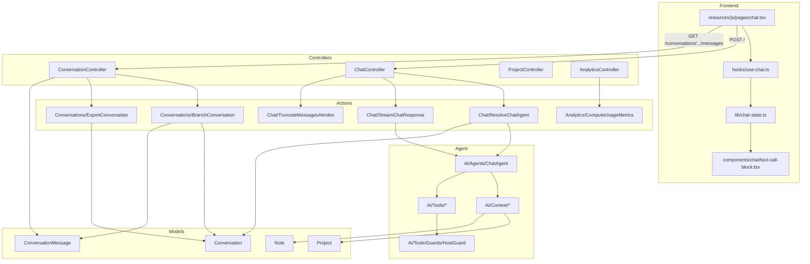
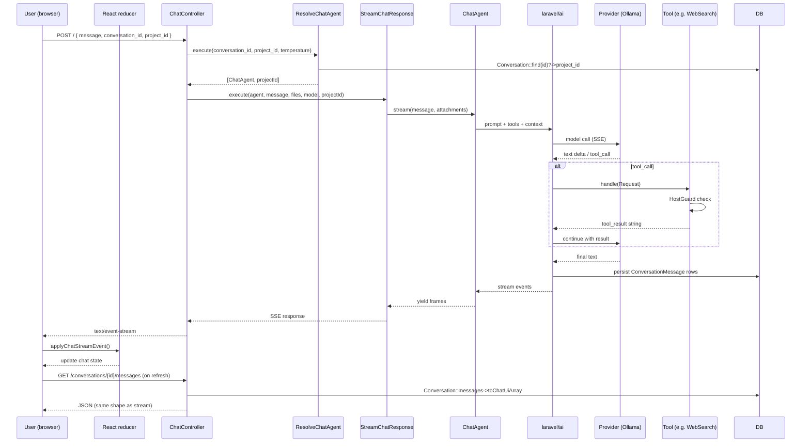
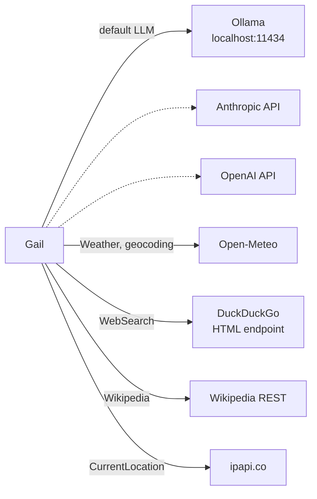

# Architecture

Gail is a Laravel 13 + Inertia v3 + React 19 application built around the `laravel/ai` package. It runs locally on the operator's machine, streams LLM responses over server-sent events, and gives the agent access to a small, extensible set of tools for web search, location, weather, calculations, and persistent notes.

This document describes how the pieces fit together and why.

Key places where concerns live — useful orientation before diving in:

- Agent selection is a runtime enum: [`App\Ai\Agents\AgentType`](../app/Ai/Agents/AgentType.php) → `ChatAgent` or `LimerickAgent`.
- Provider URL/timeout concerns are encapsulated in [`App\Services\OllamaClient`](../app/Services/OllamaClient.php), not in controllers.
- Document ingestion status is modelled as [`App\Enums\DocumentStatus`](../app/Enums/DocumentStatus.php).
- UI-payload shaping for chat messages lives in [`App\Support\Formatters\*`](../app/Support/Formatters/).
- Per-row cost estimates are derived by [`App\Support\ModelPricing`](../app/Support/ModelPricing.php) at read time.
- The anonymous operator is an explicit [`App\Support\GuestUser`](../app/Support/GuestUser.php) value object.
- The active project id flows through a request-scoped [`App\Ai\Context\ProjectScope`](../app/Ai/Context/ProjectScope.php) rather than a mutable tool setter.
- Analytics SQL dialect branching is isolated in [`App\Actions\Analytics\AnalyticsJsonSqlDialect`](../app/Actions/Analytics/AnalyticsJsonSqlDialect.php).

---

## 1. Layering

```
Presentation      React pages + SSE hook + reducer (resources/js)
     │
     ▼
HTTP              ChatController, ConversationController, ProjectController
     │            (FormRequests validate; controllers stay thin)
     ▼
Application       Actions/{Chat,Conversations,Analytics}, AttachmentService
     │
     ▼
Agent core        ChatAgent → laravel/ai → provider (Ollama/Anthropic/...)
     │                │
     │                ├── Tools (tagged ai.tools.chat, instantiated per request)
     │                └── ContextProviders (tagged ai.context_providers)
     ▼
Persistence       Eloquent: Conversation, ConversationMessage, Project, Note
                  (laravel/ai writes tool_calls / tool_results JSON columns)
```

Dependencies flow one direction: presentation → HTTP → application → agent core → persistence. There are no circular dependencies. Tools depend on `HostGuard`, the Laravel HTTP client, and config — they do **not** depend on the agent, controllers, or models (except `ManageNotes` → `Note`, which is intentional).

---

## 2. Module & dependency graph



Highlights:

- **ChatAgent** is the hub — but it doesn't import any tool class. It resolves tools and context providers via `app()->tagged(...)`, so the agent never needs to change when the tool set does.
- **HostGuard** is the single bottleneck for outbound HTTP from tools. It merges a shared deny baseline with per-tool extras.
- **No model depends on another model** except `Conversation` → `ConversationMessage` (hasMany) and `Conversation` → `Project` (belongsTo).

---

## 3. Data flow — a single chat turn



Key invariants:

- The SSE stream and the `/messages` endpoint return **identical shapes** (via `ConversationMessage::toChatUiArray()`), so a just-streamed conversation and a refreshed one render the same. The reducer in [resources/js/lib/chat-state.ts](../resources/js/lib/chat-state.ts) handles both paths.
- `laravel/ai` persists `tool_calls` and `tool_results` as raw JSON strings via a direct DB insert that bypasses Eloquent. The Eloquent `array` cast on `ConversationMessage` decodes on read but does not interfere with the package's writes.
- `BranchConversation` copies raw attributes via `setRawAttributes` specifically to avoid re-encoding already-serialized JSON columns.

---

## 4. Tool system

Tools are the extensibility surface. Each tool:

1. Implements `Laravel\Ai\Contracts\Tool` — `description()`, `handle(Request)`, `schema(JsonSchema)`
2. Implements `App\Ai\Contracts\DisplayableTool` — `label(): string` for the chat UI
3. Is registered under the `ai.tools.chat` container tag (or another `ai.tools.*` tag for a specialized agent) in [AiServiceProvider](../app/Providers/AiServiceProvider.php)
4. Resolves a `HostGuard` via `HostGuard::forTool('snake_name')` if it makes outbound HTTP calls

Tool discovery at runtime is a single line:

```php
// ChatAgent::tools()
return iterator_to_array(app()->tagged('ai.tools.chat'), preserve_keys: false);
```

Tool labels flow to the frontend via an Inertia shared prop:

```php
// HandleInertiaRequests::share
'toolLabels' => $this->toolLabels(),   // ['WebSearch' => 'Searched the web', ...]
```

So adding a new tool requires **one class + one provider registration + one line in the base prompt**. The frontend picks up the label automatically.

### Tool inventory

| Tool | Purpose | External dependency |
|---|---|---|
| `Calculator` | Evaluate math expressions | [nxp/math-executor](https://github.com/NeonXP/MathExecutor) |
| `CurrentDateTime` | Local time + timezone resolution | Open-Meteo (geocoding only) |
| `CurrentLocation` | IP-based geolocation | ipapi.co |
| `GenerateImage` | Generate an image from a text prompt, store to `public/ai-images/`, return inline markdown | `laravel/ai` `Image::of(...)` via `ai.default_for_images`. Only registered when that config is non-null. |
| `ManageNotes` | Persistent note CRUD (DB) | — |
| `SearchProjectDocuments` | Vector-similarity search over the active project's chunked, embedded documents | pgvector + `whereVectorSimilarTo` (`laravel/ai` Embeddings). Returns a friendly message if no project is scoped or no chunks are indexed. |
| `Weather` | Current + 3-day forecast | Open-Meteo |
| `WebFetch` | Read a URL's main content | [fivefilters/readability.php](https://github.com/fivefilters/readability.php) |
| `WebSearch` | DuckDuckGo HTML-search scraper | duckduckgo.com |
| `Wikipedia` | Title + intro paragraph | wikipedia.org REST API |

The `LimerickAgent` (selected via the `agent` field on `POST /`) also exposes `FindRhymesTool`, `PronounceWordTool`, and `ValidateLimerickTool` under a separate tag — see [app/Ai/Tools/Limerick/](../app/Ai/Tools/Limerick/) and [app/Ai/Agents/LimerickAgent.php](../app/Ai/Agents/LimerickAgent.php).

### HostGuard

`HostGuard` supports three pattern types:

- **Exact host**: `metadata.google.internal`
- **Subdomain wildcard**: `*.internal.corp` (matches any depth of subdomain)
- **IPv4 CIDR**: `10.0.0.0/8`

Patterns are read from `gail.tools.denied_hosts` (shared baseline applied to every tool) and merged with optional `gail.tools.<tool>.extra_denied_hosts` (per-tool additions). Only `web_fetch` currently uses the per-tool extension to add `localhost` / `127.0.0.1` for user-supplied URLs.

---

## 5. Context providers

Context providers append sections to the agent's system prompt. They are tagged under `ai.context_providers` and consulted in registration order. Current providers:

| Provider | Injects | Condition |
|---|---|---|
| `GlobalNotesContext` | The 20 most recent notes from the `notes` table | If any notes exist |
| `ProjectContext` | Project name + `system_prompt` | If the current conversation belongs to a project |

Adding a context provider: implement `App\Ai\Context\ContextProvider` (`render(?Project): ?string`) and tag it in [AiServiceProvider](../app/Providers/AiServiceProvider.php).

---

## 6. External integrations



All outbound requests from tools route through `HostGuard`. If a request targets a denied host, the tool returns an `Error: …` string and the LLM sees a graceful failure.

---

## 7. Persistence

See [data-model.md](data-model.md) for schema and relationships.

Short version:

- `agent_conversations` — conversations (soft-deleted, pinnable, branchable, project-scoped, UUID PK)
- `agent_conversation_messages` — messages (JSON columns for `attachments`, `tool_calls`, `tool_results`, `usage`, `meta`; `variant_of` for regenerations; `status` for in-flight state; UUID PK)
- `projects` — project container with `system_prompt`
- `documents` / `document_chunks` — per-project files and their embedded chunks (pgvector on Postgres)
- `notes` — key/value store used by `ManageNotes`

`laravel/ai`'s `DatabaseConversationStore` writes directly to `agent_conversation_messages` via query builder, bypassing Eloquent. Gail wraps it with [`App\Ai\Storage\TrackedDatabaseConversationStore`](../app/Ai/Storage/TrackedDatabaseConversationStore.php) and [`PendingTurnTracker`](../app/Ai/Storage/PendingTurnTracker.php) so the SSE layer can mark messages `in_progress → completed` without second-guessing the package's inserts. Model casts still kick in on read.

---

## 8. Project documents (RAG)

Each `Project` can own a set of uploaded `Document`s. `ProcessDocument` chunks and embeds them; `SearchProjectDocuments` retrieves the most relevant passages at query time.

```mermaid
sequenceDiagram
    participant U as User
    participant DC as DocumentController
    participant Q as Queue
    participant P as ProcessDocument
    participant AS as AttachmentService
    participant E as Embeddings (Ollama bge-m3)
    participant DB as documents / document_chunks
    participant ST as SearchProjectDocuments (tool)

    U->>DC: POST /projects/{id}/documents (file)
    DC->>DB: documents row (status=pending)
    DC->>Q: dispatch(ProcessDocument)
    Q->>P: handle()
    P->>DB: status=processing
    P->>AS: extractPdfText or file_get_contents
    P->>P: TextChunker::chunk()
    P->>E: Embeddings::for(chunks)->generate("ollama")
    P->>DB: insert chunks + embeddings; status=ready

    Note over ST: later, during a chat turn
    ST->>DB: whereVectorSimilarTo("embedding", query, 0.5)
    ST-->>ST: format "[Source: name, section N]\n..." passages
```

Key details:

- **Storage**: uploaded files are written to the `local` disk at `documents/{project_id}/...` (`storage/app/private/documents/...`). The DB row holds `disk_path`, `mime_type`, `size`, and `chunk_count`.
- **Status lifecycle**: `DocumentStatus::Pending → Processing → Ready | Failed`. `isTerminal()`/`isPending()` helpers on the enum drive UI polling.
- **Extraction**: PDFs use `App\Services\AttachmentService::extractPdfText`; everything else is read as raw text via `file_get_contents`.
- **Chunking**: `App\Ai\Support\TextChunker` splits the extracted text into overlapping windows before embedding.
- **Embedding model**: `ai.default_for_embeddings` (default `ollama` / `bge-m3:latest`, 1024 dims). Cached per `ai.caching.embeddings` — **off** by default.
- **Vector column**: `document_chunks.embedding` is declared as `vector(1024)` with an index **only on PostgreSQL**. Under SQLite the column is absent and `SearchProjectDocuments` will return `"This project has no indexed documents yet."` because `whereNotNull('embedding')` matches nothing.
- **Retrieval**: `SearchProjectDocuments` scopes by the request's `ProjectScope` (so cross-project leakage is impossible), filters `->whereNotNull('embedding')`, uses `->whereVectorSimilarTo('embedding', $query, 0.5)`, and caps results to 1–10 (default 5).

---

## 9. Safety net

- **Feature tests** under `tests/Feature/` with Pest 4 + RefreshDatabase
- **Larastan level 5** with a small baseline in `phpstan-baseline.neon` — do not grow the baseline; fix the underlying issue instead
- **CI** runs Pint + Larastan + full Pest suite on push/PR to `master`/`main`/`develop`
- **HostGuard** blocks cloud metadata endpoints (`169.254.169.254`, `metadata.google.internal`) by default
- **GAIL_ALLOW_REMOTE=false** restricts the HTTP surface to loopback unless explicitly opted out
