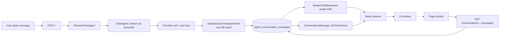

# Data model

All tables live in a single relational database. `.env.example` ships with PostgreSQL as the default driver (required for the pgvector-backed document RAG). SQLite still works for everything except `document_chunks.embedding` — the `SearchProjectDocuments` tool degrades gracefully under SQLite but retrieval returns nothing. The schema is intentionally small — Gail is single-user/local-first — and organized around conversations, messages, projects, documents, and notes.

---

## ER diagram

```mermaid
erDiagram
    USERS ||--o{ CONVERSATIONS : owns
    PROJECTS ||--o{ CONVERSATIONS : contains
    PROJECTS ||--o{ DOCUMENTS : owns
    DOCUMENTS ||--o{ DOCUMENT_CHUNKS : has
    PROJECTS ||--o{ DOCUMENT_CHUNKS : "indexed by"
    CONVERSATIONS ||--o{ CONVERSATION_MESSAGES : has
    CONVERSATIONS ||--o{ CONVERSATIONS : "branched from"
    CONVERSATION_MESSAGES ||--o{ CONVERSATION_MESSAGES : "variant_of"
    NOTES }o--|| USERS : owned_by

    USERS {
        bigint id PK
        string name
        string email
        timestamp email_verified_at
        string password
    }

    PROJECTS {
        bigint id PK
        string name
        text system_prompt
        timestamps
        softdelete
    }

    CONVERSATIONS {
        string id PK "uuid"
        bigint user_id FK
        bigint project_id FK nullable
        string parent_id FK nullable "self-ref for branches"
        string title
        boolean is_pinned
        timestamps
        softdelete
    }

    CONVERSATION_MESSAGES {
        string id PK "uuid"
        string conversation_id FK
        bigint user_id FK nullable
        string agent
        string role "user | assistant"
        string variant_of FK nullable "self-ref for regenerations"
        string status "in_progress | completed | failed"
        text content
        jsonb attachments "cast array"
        jsonb tool_calls "cast array"
        jsonb tool_results "cast array"
        jsonb usage "cast array"
        jsonb meta "cast array"
        timestamps
    }

    DOCUMENTS {
        bigint id PK
        bigint project_id FK
        string name
        string disk_path
        string mime_type nullable
        bigint size
        string status "pending | processing | ready | failed"
        int chunk_count
        timestamps
    }

    DOCUMENT_CHUNKS {
        bigint id PK
        bigint document_id FK
        bigint project_id FK
        text content
        int chunk_index
        vector embedding "pgsql only, 1024 dims"
        timestamps
    }

    NOTES {
        bigint id PK
        string key unique
        text value
        timestamps
    }
```

---

## Tables

### `users`

Standard Laravel users table. Gail does not expose a login UI in its default loopback-only configuration, but the table exists so conversations can carry an owner when you deploy behind auth.

### `projects`

| Column | Type | Notes |
|---|---|---|
| `id` | bigint PK | |
| `name` | string | |
| `system_prompt` | text, nullable | Injected by `ProjectContext` into every conversation in this project |
| `deleted_at` | timestamp | Soft delete |
| `created_at`, `updated_at` | timestamps | |

Factory: [ProjectFactory](../database/factories/ProjectFactory.php). Model: [app/Models/Project.php](../app/Models/Project.php).

### `agent_conversations`

Root table for chat threads. Created by the `laravel/ai` migration.

| Column | Type | Notes |
|---|---|---|
| `id` | string(36) PK | UUID string; `$incrementing = false`, `$keyType = 'string'` |
| `user_id` | foreign id, nullable | |
| `project_id` | foreign id, nullable | Added by [add_project_id_to_agent_conversations_table](../database/migrations/) |
| `parent_id` | string(36), nullable | Self-referencing FK to `agent_conversations.id` for branches |
| `title` | string | Auto-generated by `laravel/ai` from the first message |
| `is_pinned` | boolean | |
| `deleted_at` | timestamp | Soft delete |
| `created_at`, `updated_at` | timestamps | |

Indexes: `[user_id, updated_at]`.

Relations on [Conversation](../app/Models/Conversation.php):

```php
public function messages(): HasMany        // -> ConversationMessage
public function project(): BelongsTo       // -> Project
public function parent(): BelongsTo        // -> Conversation (self)
public function branches(): HasMany        // -> Conversation (self)
```

Scope: `scopeMatchingQuery(Builder, string)` matches conversations whose title OR any message content contains the term (case-insensitive `LIKE`).

### `agent_conversation_messages`

| Column | Type | Notes |
|---|---|---|
| `id` | string(36) PK | UUID |
| `conversation_id` | string(36), indexed | |
| `user_id` | foreign id, nullable | |
| `agent` | string | Class name of the invoking agent (usually `ChatAgent`, optionally `LimerickAgent`) |
| `role` | string(25) | `user` or `assistant` (see [`App\Enums\ConversationRole`](../app/Enums/ConversationRole.php) for the full set recognized by the application) |
| `status` | string(20) | `in_progress` while streaming, `completed` on success, `failed` on error. Default `completed`. Indexed with `conversation_id` for quick "still streaming?" checks. |
| `variant_of` | string(36), nullable | Self-referencing FK to another message id. Set by the regenerate flow so the UI can group sibling assistant replies under the same user turn. Indexed. |
| `content` | text | |
| `attachments` | json / jsonb | Cast to `array` on [ConversationMessage](../app/Models/ConversationMessage.php). Promoted to `jsonb` on Postgres. |
| `tool_calls` | json / jsonb | Cast to `array` |
| `tool_results` | json / jsonb | Cast to `array` |
| `usage` | json / jsonb | `{prompt_tokens, completion_tokens, cache_write_input_tokens, cache_read_input_tokens, reasoning_tokens}` — cast to `array` |
| `meta` | json / jsonb | `{model, provider, ...}` — cast to `array` |
| `created_at`, `updated_at` | timestamps | |

Indexes: `[conversation_id, user_id, updated_at]`, `[user_id]`, `[variant_of]`, `[conversation_id, status]`.

**Cast behavior:** `laravel/ai` writes to this table via raw query builder inserts that bypass Eloquent. The casts therefore only apply on **read**. When you write through the model (factories, seeders, `BranchConversation`), pass actual arrays — never `json_encode(...)` — or the cast will double-encode.

`BranchConversation` uses `setRawAttributes` to copy messages so existing JSON strings are inserted as-is without passing through the casts.

#### `toChatUiArray()` accessor

```php
public function toChatUiArray(): array
```

Returns the shape the React reducer consumes (identical to a live SSE response):

```php
[
    'id' => string,
    'role' => string,
    'content' => ?string,
    'attachments' => list<array{name, type, url}>,       // via App\Support\Formatters\AttachmentFormatter
    'toolCalls' => list<array{tool_id, tool_name, arguments, result}>, // via App\Support\Formatters\ToolCallFormatter
    'model' => ?string,                                  // from meta.model
    'usage' => ?array{prompt_tokens, completion_tokens, cache_write_input_tokens, cache_read_input_tokens, reasoning_tokens},
    'cost' => ?float,                                    // App\Support\ModelPricing, null for unpriced models
    'created_at' => ?string,
]
```

Used by [ConversationController::messages](../app/Http/Controllers/ConversationController.php).

### `documents`

| Column | Type | Notes |
|---|---|---|
| `id` | bigint PK | |
| `project_id` | foreign id, cascade | |
| `name` | string | Original uploaded filename |
| `disk_path` | string | Path inside `storage/app/private/` on the `local` disk |
| `mime_type` | string, nullable | |
| `size` | unsigned bigint | Bytes |
| `status` | string | `pending` \| `processing` \| `ready` \| `failed` — cast to [`DocumentStatus`](../app/Enums/DocumentStatus.php) |
| `chunk_count` | unsigned int | Populated when processing completes |
| `created_at`, `updated_at` | timestamps | |

Index: `[project_id, status]`. Model: [app/Models/Document.php](../app/Models/Document.php). Factory: [DocumentFactory](../database/factories/DocumentFactory.php).

### `document_chunks`

| Column | Type | Notes |
|---|---|---|
| `id` | bigint PK | |
| `document_id` | foreign id, cascade | |
| `project_id` | foreign id, cascade | Denormalized so retrieval can filter on project without a join |
| `content` | text | Chunk text |
| `chunk_index` | unsigned int | 0-based ordinal within the document |
| `embedding` | `vector(1024)` | **PostgreSQL only.** Populated by [ProcessDocument](../app/Jobs/ProcessDocument.php) from `ai.default_for_embeddings`. Indexed via `$table->vectorIndex('embedding')`. |
| `created_at`, `updated_at` | timestamps | |

Index: `[project_id]`. Under SQLite, the `embedding` column is absent; `SearchProjectDocuments` will find no rows with a non-null embedding and return the "no indexed documents yet" message.

### `notes`

| Column | Type | Notes |
|---|---|---|
| `id` | bigint PK | |
| `key` | string, unique | Used by `ManageNotes` |
| `value` | text | |
| `created_at`, `updated_at` | timestamps | |

Used by the `ManageNotes` tool for cross-conversation persistence. `ManageNotes::search` uses parameterized `LIKE ? ESCAPE '\'` with wildcards escaped via `addcslashes`, so user queries can contain literal `%` and `_` characters safely.

---

## Migration history

From oldest to newest (see `database/migrations/`):

1. `create_users_table` — Laravel default
2. `create_cache_table` — Laravel cache store
3. `create_jobs_table` — queue
4. `create_agent_conversations_table` — **conversations + messages**, from `laravel/ai`
5. `add_deleted_at_to_agent_conversations_table` — soft deletes
6. `create_projects_table`
7. `add_project_id_to_agent_conversations_table`
8. `create_notes_table`
9. `create_project_notes_table` — later dropped
10. `add_system_prompt_to_projects_table`
11. `add_is_pinned_to_agent_conversations_table`
12. `add_parent_id_to_agent_conversations_table` — branching
13. `drop_project_notes_table` — cleanup
14. `enable_pgvector_extension` — `CREATE EXTENSION IF NOT EXISTS vector` on pgsql only
15. `convert_message_json_columns_to_jsonb` — promotes `attachments`/`tool_calls`/`tool_results`/`usage`/`meta` to `jsonb` on pgsql
16. `create_documents_and_document_chunks_tables` — RAG tables (with `vector(1024)` column + index on pgsql)
17. `add_variant_of_to_agent_conversation_messages_table` — regenerate / alternative replies
18. `add_status_to_agent_conversation_messages_table` — `in_progress` / `completed` / `failed`

**Rule:** never modify existing migrations; add new ones.

---

## Data lifecycle



Two write paths for messages:

1. **laravel/ai** (hot path) — raw DB insert during a stream, bypasses Eloquent. Happens once per conversation turn, for both the user and assistant messages plus tool_calls/tool_results JSON blobs.
2. **BranchConversation** — copies existing rows via `setRawAttributes` inside a transaction, preserving raw JSON strings.

Factories and tests are the only other writers.

---

## Counts (expected in typical dev use)

- Conversations: O(100)
- Messages: O(10,000)
- Projects: O(10)
- Notes: O(100)

The SQLite JSON1 queries in [ComputeUsageMetrics](../app/Actions/Analytics/ComputeUsageMetrics.php) are tolerant of bad JSON but linear on `agent_conversation_messages`. For larger datasets, migrate to MySQL/Postgres (the schema is compatible) and consider indexing `(created_at, role)` for the analytics queries.
